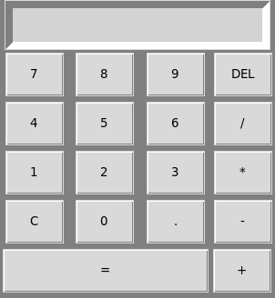
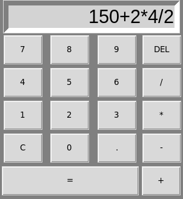
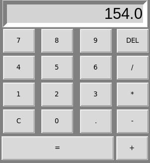
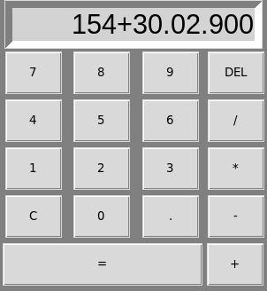
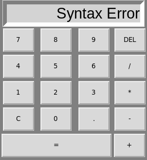

# Calculator

    

**Calculator** es una calculadora con interfaz gráfica creada en Python mediante el uso de la librería **tkinter**. Su implementación utiliza las herramientas que tkinter proporciona, así como el uso de la lógica correspondiente para el cálculo correcto de las operaciones y una mayor organización mediante el uso de POO. Como resultado, resolverá cualquier operación básica sin problemas.

Además, se utilizó **auto-py-to-exe** para generar una aplicación portable para Windows y Linux, ambas estarán en archivos comprimidos en [Apps](App).

Además del funcionamiento correspondiente a todo lo integrado dentro de la aplicación, se agregó la posibilidad de reconocer eventos al momento de presionar teclas, lo cual permite que absolutamente todas las teclas que tengan que ver con los botones, funcionaran de la misma forma que en la aplicación, así como algunas específicamente agregadas a esas tareas especiales e importantes.

## Tabla de contenidos

- [Uso y demostración](#Uso-y-demostración)
- [Entrada de datos por teclado](#Entrada-de-datos-por-teclado)
- [Explicación del código](#Explicación-del-código)
- [Créditos](#Créditos)

## Uso y demostración

1. **Calculator** es una calculadora simple, la cual puede resolver cualquier tipo de operación básica. Esta preparada para recibir una múltiple entrada de números, para calcular el resultado final, respetando siempre la jerarquía de los signos.

    

        
    

2. Esta calculadora tiene posibilidades como resolver operaciones cortas y no tan cortas, limpiar completamente lo realizado hasta el momento si se desea realizar alguna operación desde el inicio, borrar datos ya colocados en caso de equivocarse, así como el reconocimiento de datos inválidos, retornando los mensajes correspondientes.

- **Resolución de operación**

    

        
    

    

        
    

- **Error de sintaxis**

    

        
    

    

        
    

## Entrada de datos por teclado

1. **Calculator** tiene como posibilidad recibir eventos de teclado, sabiendo si alguna tecla es presionada en cualquier momento en cuanto esta es ejecutada y si son presionados los números o signos de las operaciones, todo funcionará correctamente. La diferencia esta en las opciones extras agregadas, tales como *Clear all*, *Delete*, *Igual* y *Cerrar aplicación*.

    Para estas están asignadas las siguientes teclas:

    |         Tecla          |        Acción          |
    |------------------------|------------------------|
    |         Space          |    Limpiar todo        |
    |         Enter          |    Igual               |
    |         Delete         |    Borrar datos        |
    |         Esc            |    Cerrar aplicación   |

## Explicación del código

El código se encuentra dividido en 3 archivos, dentro de nuestro archivo principal *main.py* se gestiona la inicialización de nuestra ventana, así como la conexión con el archivo *display.py* el cual se encarga de dibujar todos los widgets y finalmente este se conecta con el archivo *operations.py* el cual gestiona todo el funcionamiento que hace la calculadora por detrás para mostrar correctamente lo esperado por el display.

1. **main.py**

    **main.py** es el archivo principal donde se inicializa nuestra ventana. Aquí se utiliza la librería tkinter y la clase **Calculator** que gestiona la parte visual de la calculadora.

    Primeramente, se genera una ventana con tkinter y se aplican configuraciones básicas como el nombre y evitar que tenga resize, además se genera una instancia de la clase, para que realice toda la configuración visual establecida en ella, finalmente se agrega el **mainloop** a la ventana para que sea una aplicación interactiva.

2. **display.py**

    **display.py** utiliza tkinter para mediante una clase recibir la ventana creada en nuestro archivo principal. La clase se encarga de utilizar la ventana para generar el display y los botones, así como para asignar los colores de la aplicación. Para colocarlos correctamente uno a uno mediante el método **grid**, así como generar un objeto de la clase **Operations** del tercer archivo.

    El display se coloca en la posición inicial, mientras que los botones se colocan mediante un bucle y un método, el cual toma la posición de fila y columna correspondiente para asignarla y además asignar el método correspondiente del tercer archivo para la funcionalidad de la calculadora.

    Finalmente, la clase cuenta con el método **key_events** el cual se manda a llamar cada vez que una tecla del teclado es presionada y si la que se presiona corresponde a alguna de la aplicación, mandará a llamar al método correspondiente del tercer archivo.

3. **operations.py**

    **operations.py** contiene una clase con distintos métodos para el funcionamiento lógico de toda la aplicación, el constructor se encargara de inicializar todas las variables implicadas en el programa, mientras que el método *clear_display* se encargara de restaurar los valores una vez el usuario lo requiera o se haya dado un error por el usuario.

    **Métodos**:

    -  **click()** se puede considerar el método principal, ya que al presionar cualquier botón de operación, número o punto, se encargará de almacenar todo en la variable *display_text* que siempre contendrá lo que se muestre en el display. Todo lo hace realizando diversas comparaciones específicas, en las cuales, dependiendo del caso presentado, podrá continuar como normalmente o borrar todo para que su funcionamiento continúe, como cuando se presenta un error de sintaxis.

    - **save_numbers()** es el método que se encarga de tomar el contenido de la variable **display_text** e iterando sobre esta almacenara tanto números como signos de operaciones en dos listas distintas, *numbers* para números y **operations** para los signos correspondientes a cada operación, dándonos como resultado que por cada posición correspondiente a una operación, en esa misma posición tendremos un número y en la siguiente posición el número con el que se realizará dicha operación.

    - **calculate()** se llama cada vez que se presiona el botón para calcular el resultado final, se encarga de llamar a *save_numbers*, luego comprueba si la lista de números se ha reducido a solamente un número, lo que quiere decir que tenemos un resultado final y esto nos ayudara a seguir operando sobre un número y un tipo de operación final; si se realizó un **15+2**, si le seguimos dando al igual seguirá sumando **2** cada que sea presionado.

    Después seguirá un bloque de código manejado por una excepción. Aquí entrará en bucles cada vez que exista un signo de operación. Primero lo hace para el signo de división y al final para el de la suma, respetando en todo momento la jerarquía de los signos.

    Si un error es presentado aquí, quiere decir que la operación ingresada finaliza con un signo de operación, lo cual amerita a un error de sintaxis y es lo que se representa.

    Al calcular todo, se almacena el resultado en la propiedad **total** y es representado en el display.

    - **delete_data()** es la maravilla que permite borrar datos ingresados, sin ocasionar ningún problema en la funcionalidad total del programa, solo se encarga de tomar la variable *display_text* y borrar un elemento de esta, finalmente llama a *save_numbers* para almacenar todo el contenido y se asegura de cumplir exactamente la funcionalidad que estar solamente ingresando los datos, con la posibilidad de borrar uno a uno.

## Créditos

La imagen seleccionada como logo en un inicio corresponde al autor **Smashicons** y fue sacada de [Flaticon](https://www.flaticon.com/free-icons/calculator)
